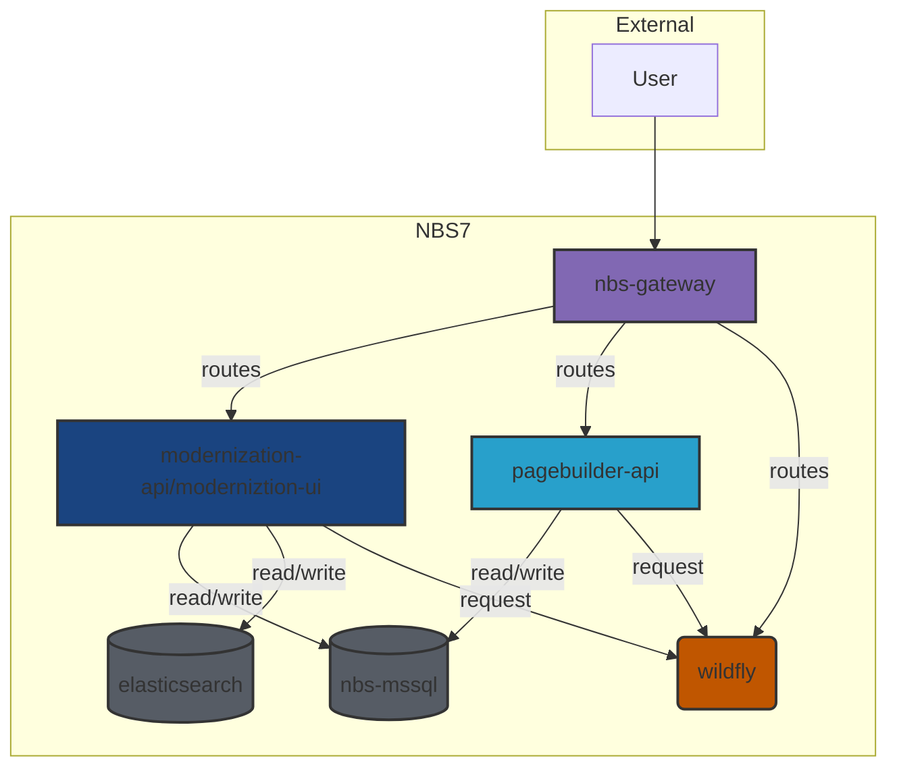

# NEDSS-Modernization

[](https://sonarcloud.io/summary/new_code?id=CDCgov_NEDSS-Modernization)

## About

### Application

- [Modernization API](apps/modernization-api/README.md) - Provides backend services and endpoints to support the
  searching and management of patients, requests related to configuration, user information, value sets, and other core
  functionalities required by the frontend and other services.
- [Modernization UI](apps/modernization-ui/README.md)
- [Question Bank](apps/question-bank/README.md) - Provides the backend services and endpoints for to support modernized
  Page Builder.
- [NBS Gateway](apps/nbs-gateway/README.md) - A reverse proxy and routing layer for the NEDSS Modernization project. It
  directs incoming requests to the appropriate backend services (such as Modernization UI, Modernization API, and
  Question bank), enabling seamless integration between both the modernized and pre-existing frontend, and multiple
  backend services.

### Libraries

Reusable code is organized into three main types:

- **Feature libraries** provide modular endpoints or features that can be integrated into applications.
- **Utility libraries** offer shared components for common tasks and standardized interactions with NBS database, and
  security model.
- **Testing libraries** supply tools and mock servers to support automated testing across modernization services.

These categories help maintain a clear separation of concerns and promote code reuse throughout the project.

#### Feature libraries

Standalone modules that provide specific endpoints or features (e.g., configuration, user info, value sets, redirects)
which can be packaged within other applications.

- [Configuration](libs/configuration-api) - An endpoint to expose externalized configuration to the `modernization-ui`.
- [Me-api](libs/me-api) - An endpoint that provides information about the currently logged-in user.
- [Options-api](libs/options-api) - Provides endpoints to retrieve the contents of value sets.
- [Redirect](libs/redirect) - A generic endpoint to handle transitions from `wildfly` to `spring-boot` based services.

#### Utility libraries

Shared components that offer common utilities and standardized interactions with NBS data and the WildFly application,
such as auditing, authentication, authorization, data flattening, and session propagation.

- [Accumulation](libs/accumulation) - Flattening the results of select statements that join multiple tables into single
  objects or lists of objects grouped by a common identifier.
- [Audit](libs/audit) - Standardizes the auditing fields on NBS tables
- [Authentication](libs/authentication) - An adapter that incorporate the NBS security model in Spring Security.
- [Authorization](libs/authorization) - Allows resolution of the object / operation specific NBS permissions.
- [Change](libs/change) - Resolves changes between disparate collections of items representing the same underlying
  models.
- [Classic Interaction](libs/classic-interaction) - Propagates the session associated with a user when transitioning
  between `wildfly` and `spring-boot` based services.
- [Database-Entities](libs/database-entities/README.md)
- [Event-Schema](libs/event-schema/README.md)
- [Id Generator](libs/id-generator/README.md) - A Java implementation of the `getNextUid_sp` stored procedure used to
  create identifiers within NBS.
- [Web](libs/web) - Standardizes handling of Cookie management and provides a common `Response` pattern.

#### Testing libraries

Modules that implement reusable feature test steps and mock servers to support automated testing across modernization
services, including user setup, database containers, HTTP response verification, and test data management.

- [Auth](libs/testing/auth) and [Auth Cucumber](libs/testing/auth-cucumber) - Enables feature test steps for
  establishing users and permissions.
- [Classic Interaction Cucumber](libs/testing/classic-interaction-cucumber) - A mock server to verify interactions with
  `wildfly`.
- [Database](libs/testing/database) - [Testcontainer](https://testcontainers.com/) support for the `nbs-mssql`
  container.
- [HTTP Interaction](libs/testing/http-interaction) - Enables feature test steps to verify the status and body of HTTP
  Responses.
- [Identity](libs/testing/identity) - An in memory implementation of the NBS ID Generator to reduce database activity
  during tests.
- [Support](libs/testing/support) - An API to make referencing data created for tests.

### Development

The [CDC Sandbox](cdc-sandbox/README.md) provides containers to support local development.

#### Guidelines

- [Package by Feature](documentation/Package-By-Feature.md) to make code easier to find.
- [Code Formatting](documentation/Code-Formatting.md)
- [Pull requests](documentation/Pull-Requests.md)

#### Configuring local development secrets

Some containers within the `cdc-sandbox` directory require sensitive values be set prior to building.

The project includes a `sample.env` file with reasonable defaults for local development. The `cdc-sandbox` directory
has a script to create a new `.env` file and export those values.

```sh
cd cdc-sandbox
source ./check_env.sh
```

> **Note**: You must use `source` (or `.`) to ensure the variables persist in your current shell. Running the script as
> `./check_env.sh` will not export the variables to your active session.
>
> **Windows Users**: Use Git Bash (included with Git for Windows) or WSL. Standard PowerShell or Command Prompt do not
> support this syntax.

| Environment variable    | Container         | Notes                                      |
|-------------------------|-------------------|--------------------------------------------|
| DATABASE_PASSWORD       | nbs-mssql, nifi   | 8+ letters with upper, lower, special char |
| NIFI_PASSWORD           | nifi              |                                            |
| KEYCLOAK_ADMIN_PASSWORD | keycloak          |                                            |
| PARAMETER_SECRET        | modernization-api | generated by `openssl rand -base64 32      | cut -c1-32` |
| TOKEN_SECRET            | modernization-api | generated by `openssl rand -base64 64`     |

If you need to customize these values, edit the .env file created in the root directory and run `source ./check_env.sh`
again to apply the changes.

### Running everything inside docker

1. Gain access to the [NBS source code repository](https://github.com/cdcent/NEDSSDev) _this is required to build the
   wildfly container_. The docker compose assumes the `NEDSSDev` repo is named as such and cloned as a sibling to this
   repo. If that is not the case, set the environment `NEDSSDEV_PATH` to the appropriate location.

   Ensure `NEDSSDev` is checked out to the version you want to use and properly instantiated (including DB submodule -
   see its README for details)

2. Navigate to the `cdc-sandbox` directory

   ```sh
   cd cdc-sandbox
   ```

3. Run the `build_all.sh` script

   ```sh
   ./build_all.sh
   ```

4. Visit the [NBS Login page](http://localhost:8000/nbs/login)

   ```
   username: superuser
   password:
   ```

5. To stop the containers, use docker compose

```sh
docker compose down
# OR to also reset DB volume
docker compose down -v
```

To learn more about the build process view the cdc-sandbox [README](cdc-sandbox/README.md)

### Running the Modernization API and UI in development mode

1. Navigate to the `cdc-sandbox` directory

   ```sh
   cd cdc-sandbox
   ```

2. Start the database and Elasticsearch containers

   ```sh
   docker compose up -d nbs-mssql elasticsearch
   ```

3. Navigate to the root directory

   ```sh
   cd ..
   ```

4. Start the `modernized-api` _Port `5005` will be open for debugger attachment._

   ```sh
   ./gradlew :modernization-api:bootRun
   ```

5. Navigate to the `modernization-ui` folder

   ```sh
   cd apps/modernization-ui/
   ```

6. Launch the `modernization-ui`

   ```sh
   npm run start
   ```

7. Access the [UI](http://localhost:3000)

### Print Artifact Version

```
./gradlew printVersion


> Task :printVersion
Version: 1.0.0-SNAPSHOT
```

### Running with local servers

The `nbs-gateway` container is configured to route to the containerized services. Routing to a local service can be
achieved by altering the configuration to point to the local instances.

| Name                     | Default             | Description                                                     |
|--------------------------|---------------------|-----------------------------------------------------------------|
| MODERNIZATION_UI_SERVER  | `modernization-ui`  | The host name of the server that provides the frontend UI.      |
| MODERNIZATION_UI_PORT    | `80`                | The port the frontend UI is served from.                        |
| MODERNIZATION_API_SERVER | `modernization-api` | The host name of the server that provides the backend API.      |
| MODERNIZATION_API_PORT   | `8080`              | The port that modernization-api is served from.                 |
| PAGEBUILDER_API          | `pagebuilder-api`   | The host name of the server that provides the page-builder API. |
| PAGEBUILDER_API_PORT     | `8095`              | The port that page-builder is served from.                      |
| NBS_GATEWAY_SERVER       | `nbs-gateway`       | The host name of the server that provides the NBS Gateway.      |
| NBS_GATEWAY_PORT         | `8000`              | The port the NBS Gateway is served from.                        |



#### Configuring the NBS-Gateway to use local modernization-ui

1. Start the frontend UI locally by running the following command from the `apps/modernization-ui` folder.

   ```shell
   npm run start
   ```

2. Start the `nbs-gateway` container configured to route to the local `modernization-ui` by executing the
   following command from the root folder

   ```shell
   MODERNIZATION_UI_SERVER=host.docker.internal MODERNIZATION_UI_PORT=3000 docker compose up -d nbs-gateway
   ```

#### Configuring the NBS-Gateway to use a local modernization-api

From the root folder.

1. Start the backend API locally listening on port 9080 from the root project folder. The `nbs-gateway` container is
   accessible from port `8080`, which is the default port for the `modernization-api`. It must be changed in order for
   the
   backend to start properly.

   ```shell
   ./gradlew :modernization-api:bootRun --args='--server.port=9080'
   ```

2. Start the `nbs-gateway` container configured to route to the local `modernization-api` by executing the
   following command.

   ```shell
   MODERNIZATION_API_SERVER=host.docker.internal MODERNIZATION_API_PORT=9080 docker compose up -d nbs-gateway
   ```

#### Configuring the NBS-Gateway to use a local pagebuilder-api

From the root folder.

1. Start the local `pagebuilder-api` service.

   ```shell
   ./gradlew :question-bank:bootRun'
   ```

2. Start the `nbs-gateway` container configured to route to the local `pagebuilder-api` by executing the
   following command.

   ```shell
   PAGEBUILDER_API=host.docker.internal PAGEBUILDER_API_PORT=8095 docker compose up -d nbs-gateway
   ```

#### Resetting to Docker only

Start the `nbs-gateway` container by running the following command from the root folder

```shell
docker compose up -d nbs-gateway
```
